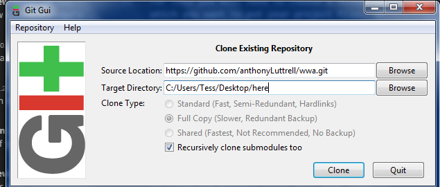
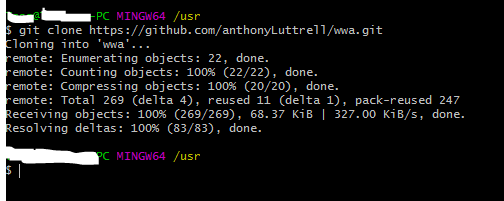
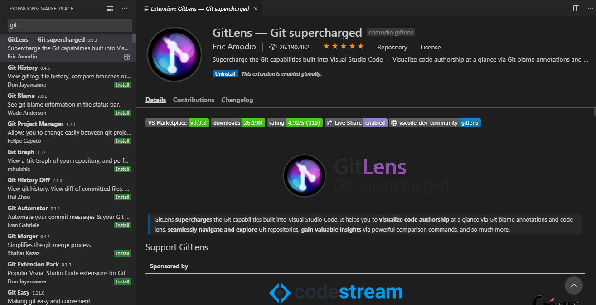
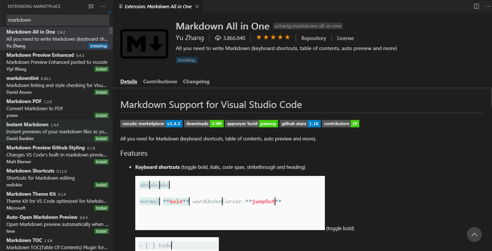
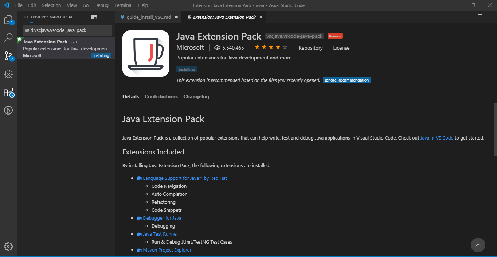
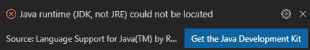
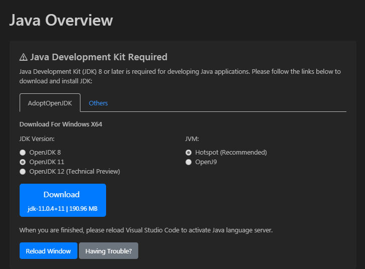
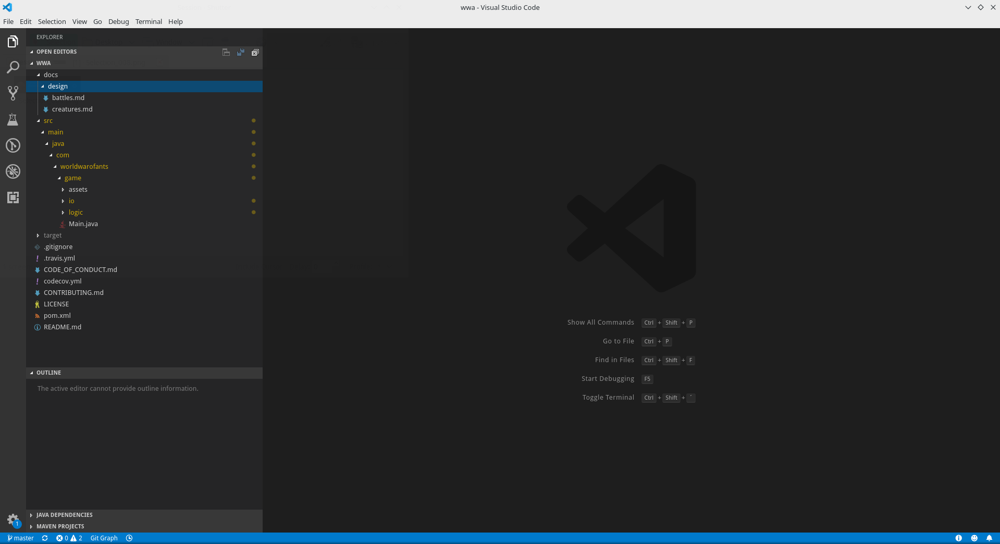
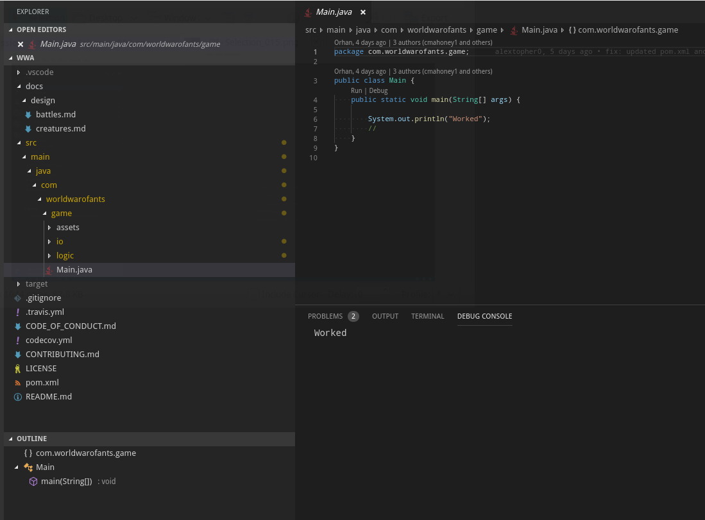

# Guide: getting VSC (an IDE) and the Project to work <!-- omit in toc -->

VSC = Visual Studio Code, an IDE developed by microsoft.
This guide is aimed to help complete beginners to install Visual Studio Code and start looking through the project in order to get a better understanding.
For a specific area please follow the Table of contents.
If you find anything missing contact ZweiEuro#2274 on the Discord server.


- [What is an IDE?](#what-is-an-ide)
- [What is git?](#what-is-git)
- [Getting the required software](#getting-the-required-software)
  - [getting an IDE](#getting-an-ide)
    - [getting VSC (Visual Studio Code)](#getting-vsc-visual-studio-code)
  - [getting git](#getting-git)
- [Getting the repository](#getting-the-repository)
  - [Git the project](#git-the-project)
    - [GUI](#gui)
    - [BASH](#bash)
- [Setup IDEs](#setup-ides)
  - [Setup Visual studio code](#setup-visual-studio-code)
    - [VSC extensions](#vsc-extensions)
    - [Adding the project to VSC](#adding-the-project-to-vsc)
    - [run the project in VSC](#run-the-project-in-vsc)

## What is an IDE?
An IDE is a piece of software which makes developing other software easier. It contains debugging tools for finding errors, and allows for execution of programs. This makes it possible to develop features and fix bugs quickly and efficiently

## What is git?
Git is a piece of Version Control software. It keeps track of changes to code made at different times and by different people. It also makes it easy to stay updated with the work that's been done. These features make it easy and convenient to work on a project together with others.

## Getting the required software
Generally for developing you almost always use an IDE.
You are free to develop in any IDE you like.

### getting an IDE
#### getting VSC (Visual Studio Code)
Download VSCode [here](https://code.visualstudio.com/#alt-downloads).
Download VSC for your appropriate system.

### getting git
Git all in all is a very lightweight program and there are a lot of clients for it. You will have to find your version yourself [here](https://git-scm.com/book/en/v2/Getting-Started-Installing-Git). 


## Getting the repository

### Git the project
We will start by cloning the main project, which means you can change files locally but not push them to the main project. This will be explained later on git forks and pull requests and how they work, for now this is just for demonstration purposes.

First off, let's start by getting the repository onto your computer with git.
For this you will need to choose a folder in which you want to put your project files, it doesn't matter where but on Windows machines Documents makes most sense and on Linux/Max OSX machines ~/ (home) makes the most sense.

On windows if you have installed all the git tools from the installer you should be able to right click and choose an option "Git GUI here" or "Git Bash here". On linux you will need to use a terminal (in which case the process is the same as in the git bash). 
#### GUI
- In the git GUI you can choose "clone repository" to clone the project files onto your computer.
   

- Choose a place to store your project files. (Target)
- And as a source enter the github link. https://github.com/anthonyLuttrell/wwa.git


- after clicking clone the program will create a folder with the name you chose, in this case "here".
-  When finished, git GUI can be closed.

#### BASH
- open a bash / a terminal.
- useful commands:
  - use ```cd``` (change directory) to move somewhere you want the project to be.
  - with ```pwd``` (powered directory) you can see where you currently are.
  -  ```ls``` (list) tells you what files are in the folder you currently are.
- Enter the command:
  ```git clone https://github.com/anthonyLuttrell/wwa.git```
  
- this will create a folder wwa in which the project files are located.

## Setup IDEs
### Setup Visual studio code
#### VSC extensions
Start VSCode for the first time, we will be needing to install a few extension to make things easier in the future.
You can Install extensions (and search them) via this:


For now we will need a few things:
- (optional) "Git lense" in order to use git from VSCode with more power than the build in methods:
  
- (optional) Markdown if you want to read the guides inside VSC 
- Install a java extension 

*IMPORTANT* IF you do not have a java JDK/Version installed on your computer you might get his message: 
do not panic, just ignore it.
If you do not have Java Development Kit installed (or if Visual Studio Code plugin can't find it), a window offering to install it will be shown.

select JDK 8 (because War of Ants is using JDK 8) and follow the download instructions/install instructions. Make sure to restart VSC after installation.

####  Adding the project to VSC
In VSCode click "File" -> "Open Folder..."
and choose the folder with the repository

You should now see something like this:

If the colours are missing wait for them to fade in, some extensions take a little longer to load.

#### run the project in VSC

Selecting the main.java file should show you a simple program that just prints out to the console (for now at least). The main function is where every program has to start.
You should see a "Run | Debug" appear on top of the main function (not the class) clicking them should run your program. 


If this works you have set up the environment correctly and are ready to code.
With this tutorial you have set up a copy of the main project files, which do not allow editing (if everyone could just edit these files without some kind of review process it would be impossible to get any work done).

There will be other tutorials which explain how to setup a copy of the project ( a fork) and change the actual code. For now you can explore the project files, don't worry if you break something or not, just repeat the clone process and reopen the folder in VSC in order to reset everything to a working state.

