# Guide: How to setup git fork & start working on the project <!-- omit in toc -->
This tutorial assumes that you already have a working VSC setup and java plugins.


- [What is a fork?](#what-is-a-fork)
  - [How to make a fork of WWA](#how-to-make-a-fork-of-wwa)
    - [What did you just do?](#what-did-you-just-do)
  - [How do I work with this?](#how-do-i-work-with-this)
  - [Basic overview how git works.](#basic-overview-how-git-works)
- [Creating a pull request](#creating-a-pull-request)


## What is a fork?
A fork is a sort of split of a git repository (git project).
For the sake of simplicity this tutorial will keep it very practical.

### How to make a fork of WWA
You need to be logged into github for this to work.
- Go to: ``` https://github.com/warofants/wwa ```
  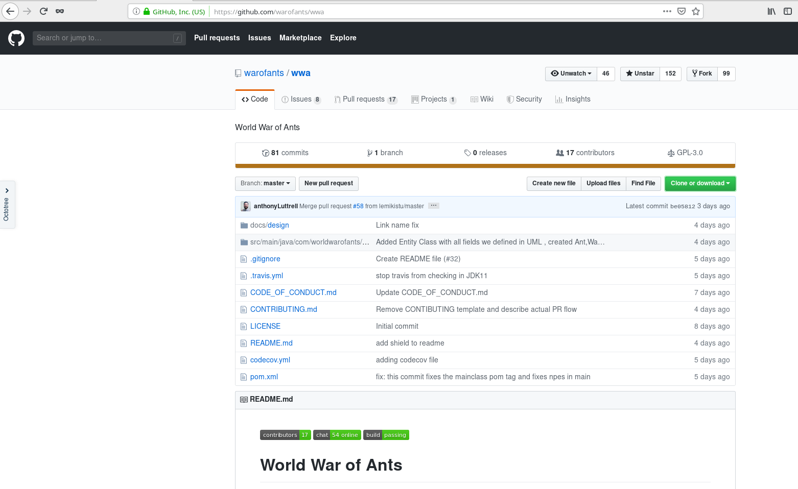
- In the top right, there is a the fork Symbol, which is what you want to click.  The number is irrelevant.
- select your account. I you have already forked the same repository once, this will not work. 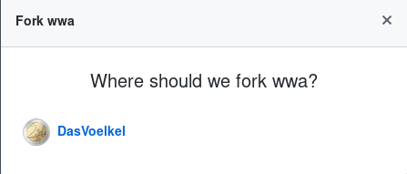
- Wait for the forking process to finish 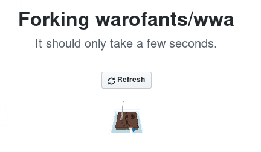
- Now you see a very similar page, with one very important difference: The name of the repo will have changed from wwa to <Your github username>/wwa: 

#### What did you just do?
You just created a copy of the main repository for your github account. On this repository you can commit/push/merge all you want, without a problem. 
Previously this didn't work since not everyone is allowed to push/merge on the main project.

### How do I work with this?
Well, since this is a new repository, you will have to clone it once again to your computer in order to work on it, the process is the same as with the main project repository.

```git clone https://github.com/<github username>/wwa.git ```
For me this link looks like ```https://github.com/DasVoelkel/wwa.git```
As before you can show the link by clicking the green "Clone  or download" button.

Now you have your own project files. For example we will commit this exact guide via pull request to my own repo.

### Basic overview how git works.
For git there is a little bit of a process which needs explanation and can be a bit overwhelming.
Please note that i am using this guide as an example, so as I add pictures there will be more files to stage and commit to the next version.
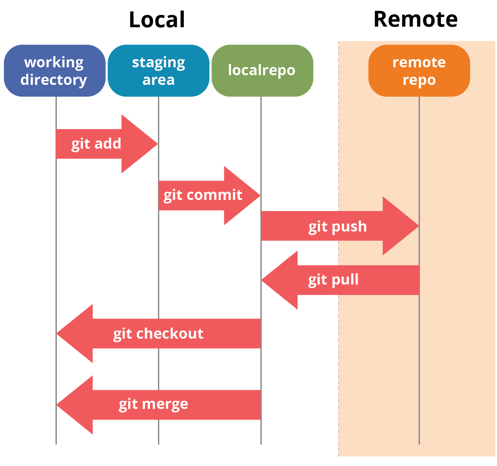
We could be using git only via the terminal, but this can be a bit tedious and there are better alternatives (We will use VSC builtin git, but we installed gitlense earlier which will give you even more control if you need it.).

All in all it works like this:

- If you add/edit a file, git will take notice and notices the difference. It will show you that a file has been changed by colouring its name green in the file explorer. Git doesn't really care about these files yet. This is also indicated by the green "U" next to the file names.
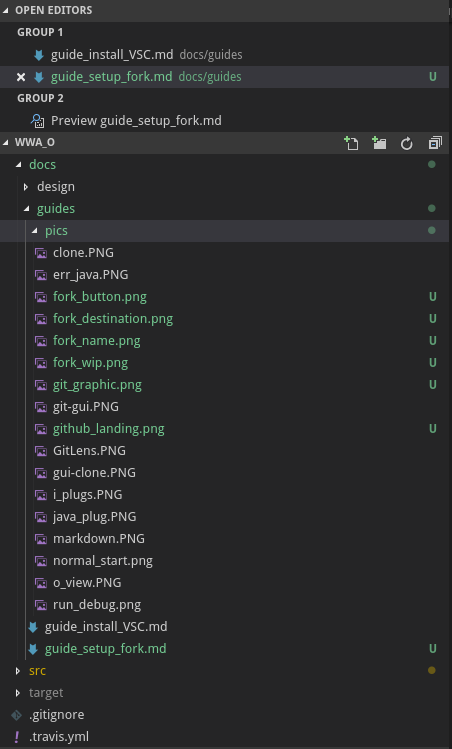

- now we could "git add"(stage) each file that we want to add to a new version of our project. But we can use gitlense to make this process easier to see. For this select the git tab on the far left. 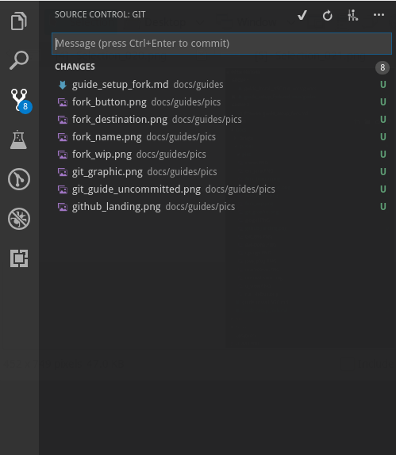

- Select the files you want to add to the next version of your project. (you can select multible files with shift/ctrl).
-  Now for each file you can see option pop up on the right side. 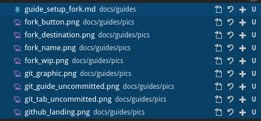. The tooltip will tell you what they do. Note:
   -  "discard" essentially means reset this file to the state of the last known version, which for new files will delete it.
-  Now press the plus to stage/add the files you want in the next version of the project. This will move it up to "staged changes" they are marked as "Yes please add this in the next version" but are not yet actually committed to the file change.  Of course you can always unstage the file, the "A" means that it has been "added", there will be a "M" for modified. So in this example the picture will be added within the next version we commit to the project.
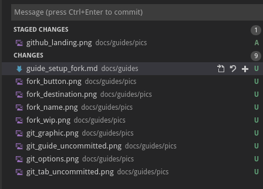
- When you have added all the pictures you want in the next version, you can commit the changes and make it "real" for your local version of the project.
- To commit click the "check mark" a dialogue will appear asking you what to name this commit, be descriptive or we will lose track very quickly of what goes where. Later if something breaks we can make sure where to look by checking the commit names and what files they touched. 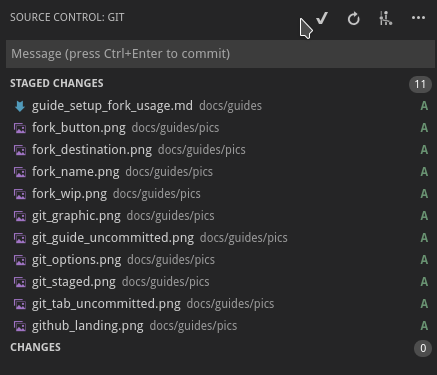.
  - The commit message will be typed into a box saying "Commit message" in the middle top of the screen in VSC, this is easy to miss. 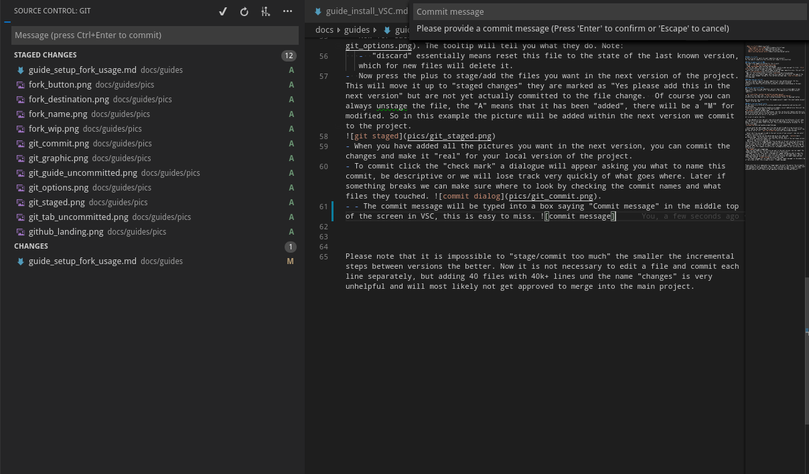
- I will type into the message "adding guide for git and fork usage + pictures, practical example"
- Now the data has been committed and the version is now synchronized, you will noticed the "U" missing in the file explorer, this was the desired effect. These changes are now only "local" on your machine, in order to push them into your git fork repository, you will need to click the 3 dots on the top right on the git tab and select push. Later on if you are working on other branches you can select "push to" in order to put it onto another branch than master, for now your fork should only have a master branch as is. 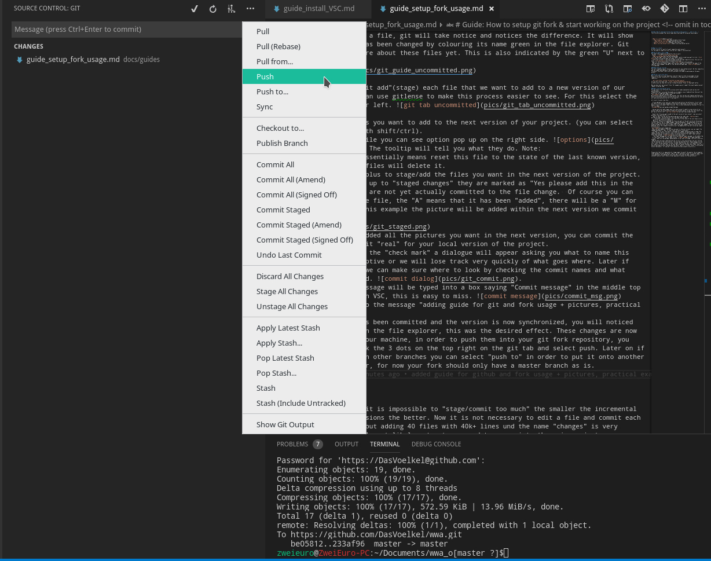

- As before with the commit message VSC will prompt you to enter your github username and password.
- After which you can see your changes on your fork of github. 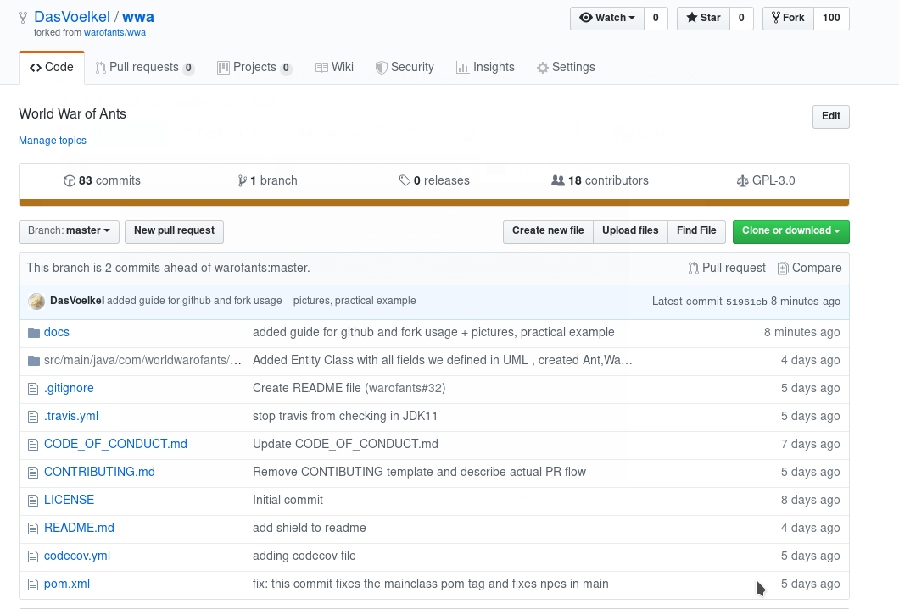


Congratulations! You have just made your first project change! 
This process will become second nature soon enough.
Now there is a lot I have ignored for simplicities sake, if you have some questions ask the mentors. E.G. i did not get into details about branches, merging etc.

Please note that it is impossible to "stage/commit too much" the smaller the incremental steps between versions the better. Now it is not necessary to edit a file and commit each line separately, but adding 40 files with 40k+ lines und the name "changes" is very unhelpful and will most likely not get approved to merge into the main project.

## Creating a pull request

If you want to get your code reviewed and maybe added to the main project (as i do with this guide)

We can do that via github.
- On the same horizontal line as "Clone or download" on your github fork, is a button called "New pull request", if you are _certain_ and have _made extra sure_ that all your files have been added to the commit you want to add to the main project, click it. 
- It will show all changes, gloss over it and check if it all looks about right, if you have worked cleanly before you do not need to read every single line you have edited.
- Click the green button "Create pull request"
- Give it a title and describe what you have done, for a rule of thumb the title of your pull request should be usable in a sentence.
  - for the description be as thorough as you think is necessary, as before there is no "too much information" but don't write huge essays, if you think you need to you might commit too much at once and should split the load off into smaller changes. Remember that a pull request will merge the _current_ state of your fork with the main project, so it is not a problem if you have made a lot of commits over years, git will check that there are no conflicts with the merge, if there are please message a moderator since this can be a bit complicated.
- I will call it "Adding usage and setup guide for forks and git" and will add in the description "also adding lots of pictures for clarity".
- done

Pull requests need to be reviewed by someone before they are merged, so a lot of pull requests generate a ton of work for mentors, please do not spam requests at us as it will slow us down and DDOS our other tasks.

After making a pull request, shoot your mentor a message. so we don't lose complete track.